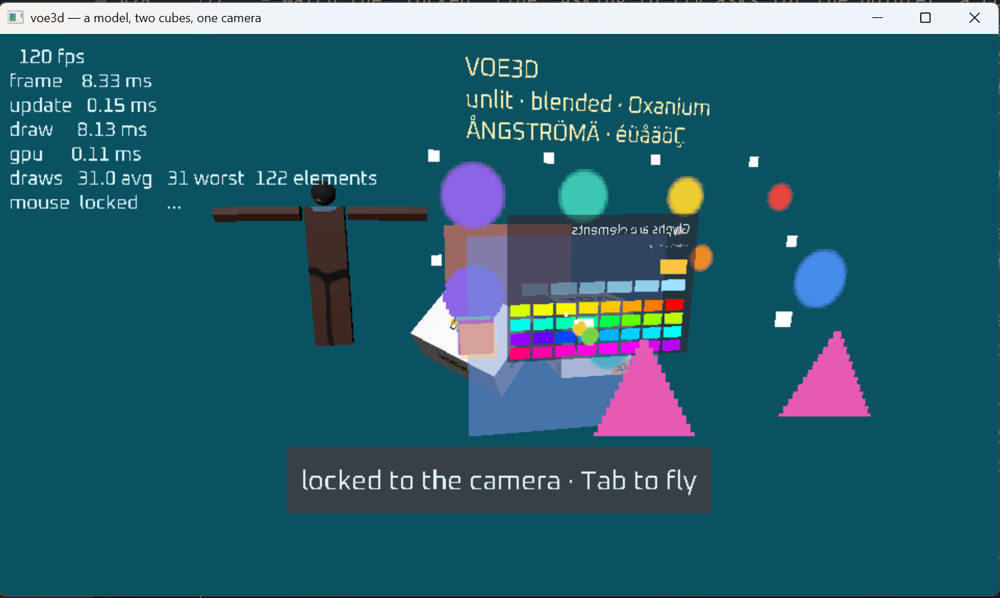
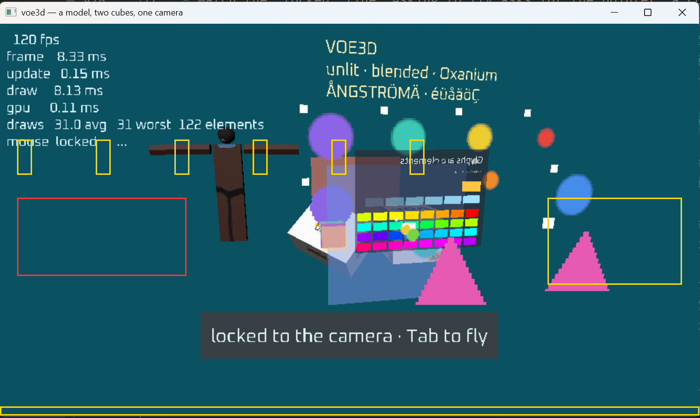

# bug 001 — the screen-filling element surface draws nothing on Windows

status: card 044
archived: 2026-09-10, on card 044 being written — ADR-0110: the inbox holds only
  reports awaiting a decision. **Comes back to `bugs/` if 044 does not fix it.**
found-by: the principal, 2026-09-10, running `voe_dev` from CLion on Windows
reported-by: claude-opus-5
folder: `render`
severity: everything mapped onto the window is invisible. The world is unaffected.

**The numbering is this bucket's own and starts at 001.** It is not the cards'
sequence: a card's number comes from the plan and a bug has no place in one.

**Update 2026-09-10, by the tech lead: this file's shape became the convention.**
It was written as *a first shape and not a convention*, on the grounds that the
shape was the principal's to settle. He settled it by adopting this — ADR-0108 —
and ADR-0109 widened intake so that anyone, end users included, may report. **The
eight sections here are what an *investigation* produces**, not what a reporter must
supply. `status:` is now one of `new`, `investigated`, `card NNN`, `closed`, `not a
bug`; this report is `investigated` and waits on the experiment below.

**Decided 2026-09-10 — ADR-0111, and card 044 carries the work.** The element
surface's z moves off the boundary to `0.9999`, with a plain arithmetic test
pinning it strictly inside. **The decision is deliberately *not* justified by this
report's diagnosis**, which cannot be confirmed on the verification machine: it
rests on the checkable ground that standing exactly on a clip boundary buys nothing
and is the one position where two conformant drivers may legitimately disagree. **So
if Windows is still blank afterwards, the rule is still right and this report comes
back to the inbox with a new suspect.** Two heavier answers were considered and
rejected in the ADR — a depth clear before the surface, and disabling the depth test
for it — and the depth clear is the one to reach for if this site ever returns.

**Reviewed the same day, and the hypothesis stands with three things added.**

- **The depth test is innocent, which the report did not consider and a reviewer
  asks first.** Depth clears to `0.0` (`VOE_RENDER_DEPTH_CLEAR`) and every missing
  rectangle sits on untouched background, so a fragment at 1.0 would pass `GREATER`
  trivially. The rectangles never reached that stage — the primitive was discarded
  before rasterisation, which is what the near-plane hypothesis predicts and the
  depth test cannot explain.
- **The z and w that reach clip space are bit-exact 1.0**, not merely close: row 2 of
  the composed matrix is `[0,0,0,1]` and row 3 is `[0,0,0,1]`, so the product is
  1.0 × 1.0 with no arithmetic that could drift over the boundary. **So this is not a
  rounding error crossing a line** — it is a driver treating an inclusive bound as
  exclusive. `depthClampEnable` is unset in the element pipeline, so clipping is on.
- **The experiment should use `0.9f`, not `0.999f`.** At 0.999 a negative result
  would not be conclusive — it is still within a thousandth of the boundary. 0.9 is
  unambiguously inside, so the answer means something either way. **It is a
  diagnostic and not the fix**: the permanent value wants to be as near the plane as
  is safe, because anything further back can be occluded by geometry very close to
  the camera. Choosing it is the decision this report is waiting on.

## What happens

Nothing submitted to the screen-filling element surface reaches the screen.
Every element drawn *after* the draw system's walk is missing: card 032's plate,
its six ticks and its full-width bottom bar, and card 034's whole interface —
the panel, the heading and both buttons.

The world is fine. The two element **panels** — the exhibit and the badge — draw
correctly in the same frame, and so does everything else: the models, the cubes,
the sprites, the quads, the sign and the readout.

The same shot with every missing rectangle marked — **yellow** is card 032's
surface, **red** is card 034's interface, and every one of them is empty:

## What should happen

Six salmon ticks across the upper third, a dark plate with a white square in it
against the right edge, a dark bar along the very bottom, and the interface at
the left below the readout. All of it is drawn on Linux and has been since the
cards that built it.

## It is submitted and it is drawn

This is not a missing call, a stale build or an unbuilt file. The counts prove
the records went in and the draws were recorded:

| | Windows, from the readout in the screenshot | Linux, same code |
|---|---|---|
| element records | `122 elements` | `122 element records` |
| draw commands | `draws 31.0 avg 31 worst` | `31 commands`, `the walk was 29 of them` |

122 is 80 for the exhibit, 5 for the badge, 9 for the surface and 28 for the
interface — so the surface's nine and the interface's twenty-eight were both
accepted. 31 commands is 29 in the walk plus one for the surface and one for the
interface. The commands are in the buffer; the pixels do not land.

The principal's build was current when the shot was taken:
`cmake-build-debug/dev/voe_dev.exe` and `.../src/interface.c.obj` both dated
10:36:35, `dev/src/interface.c` 10:36:12, screenshot 10:46. The folder globs use
`CONFIGURE_DEPENDS`, so a newly added source is picked up without a CMake edit.

The pixels were measured rather than eyeballed. Client area 1439 x 808, so
5.985 px/mm and a 240.4 x 135.0 mm surface. Every position below holds the
background colour exactly:

    tick 0            8.5,  46.0 mm -> px   51, 324 = (10, 82, 97)   background
    tick 1           35.5,  46.0 mm -> px  212, 324 = (10, 82, 97)   background
    tick 2           62.5,  46.0 mm -> px  374, 324 = (10, 82, 97)   background
    tick 3           89.5,  46.0 mm -> px  536, 324 = (10, 82, 97)   background
    plate           211.4,  75.0 mm -> px 1265, 498 = (10, 82, 97)   background
    white square    203.4,  69.0 mm -> px 1218, 462 = (10, 82, 97)   background
    bottom bar      120.2, 133.5 mm -> px  720, 848 = (10, 82, 97)   background
    interface panel  20.0,  63.0 mm -> px  120, 426 = (10, 82, 97)   background
    counter button   20.0,  76.0 mm -> px  120, 504 = (10, 82, 97)   background

Ticks 4 and 5 land on world geometry and are excluded; the rest is untouched
background.

## Where it isolates to

A panel and this surface go through **the same pipeline, in the same frame, with
the same depth state**, through the same `voe_render_frame_draw_elements`. A
panel draws and this does not. The one thing that differs is the matrix: a panel
gets the draw system's world-to-clip matrix, and this gets
`voe_render_element_transform`.

## The suspect, and it is a hypothesis and not a finding

`render/src/element.c`, in `voe_render_element_transform`:

    // Z: THE NEAR PLANE, WHICH IS 1.0 BECAUSE DEPTH RUNS BACKWARDS HERE.
    onto_the_target.m[2][3] = 1.0f;

z is the constant 1.0 with w = 1.0, so every vertex of this surface sits exactly
on the near plane. A panel takes its z from the camera and never lands on the
boundary. Geometry exactly on a clip boundary is the classic thing that survives
a software rasteriser and is discarded by a driver, and the only card in the
verification machine is lavapipe.

**It has not been proved.** Nothing has been measured inside `render` and no
other candidate has been ruled out — depth clamp or clip state, or the blend
state on this driver, would look identical from outside.

## What confirms or kills it, in one line

Change that `1.0f` to `0.999f` in `render/src/element.c` and rebuild. If the
ticks, the plate, the bar and the whole interface appear together, the cause is
settled. If nothing changes, the near plane is innocent and the next thing to
look at is the pipeline state, not the matrix.

The line was **not** changed as part of this report. It is `render`, the coder
was working in `dev`, and backwards depth with the near plane at 1.0 is a
settled engine convention — moving it is a decision and not a patch, so it needs
the tech lead and an ADR rather than an edit.

## Why it was not caught before

Every card that built this path recorded that Windows was unchecked with no
machine available to check it on: 030 the element buffer, 032 the panel
component, 040 the draw count, and 034 the widgets. That is the one-platform
rule (2026-09-04) working exactly as written — the other platform is checked
when that machine is next booted, and what it turns up becomes a new report
rather than reopening the old cards.

So: **card 034 is not at fault and should not be reopened.** The interface it
added is the second thing this fault hides, not the cause. The fault is older
than 034 and would be visible with 034 backed out.

## Verified on

Windows: the principal's machine, CLion, Ninja, `C:/Program Files/LLVM/bin/clang.exe`,
window client area 1439 x 808. The fault is here.

Linux: WSL2 with lavapipe (llvmpipe, Vulkan 1.4.335). `cmake -P check.cmake`
exits zero — 39 tests, analyser clean over 106 files — and every one of the
missing rectangles draws correctly. **The fault does not reproduce on the
verification machine**, which is why it needs the principal's screen to close.

## Notes

The readout in the screenshot says `mouse locked`, which is fly mode: the
pointer is captured and nothing would be hovered even once the surface draws.
Escape hands it back. It is not part of this fault and is noted so that nobody
mistakes it for one.
